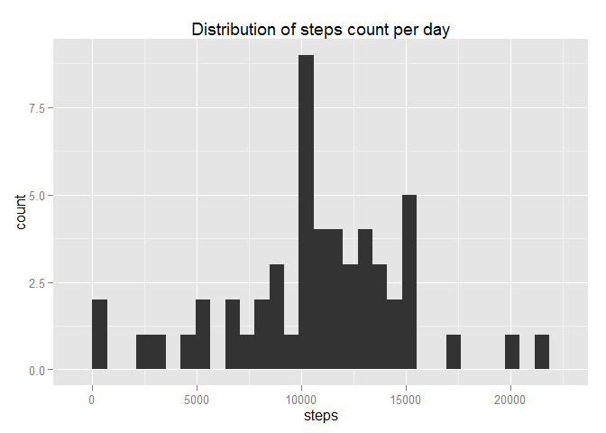
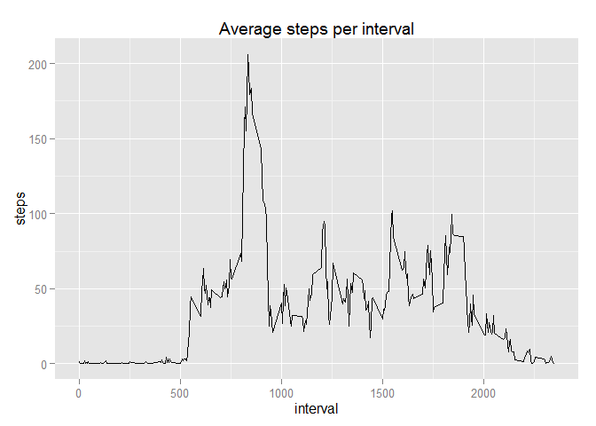
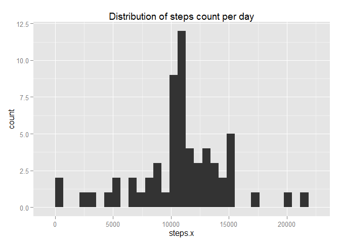
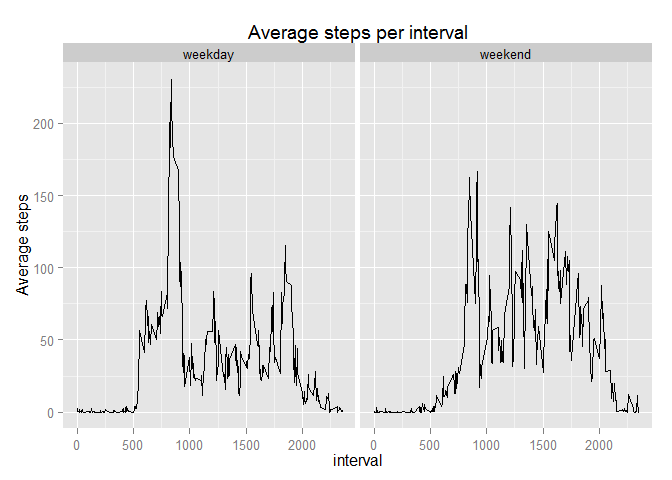

# Reproducible Research: Peer Assessment 1


## Loading and preprocessing the data

```r
data <- read.csv("activity.csv")
data$date_d <- as.Date.factor(data[[2]])
library(ggplot2)
```

```
## Warning: package 'ggplot2' was built under R version 3.1.2
```

```r
data_a <- aggregate(.~date,data[1:2], FUN=sum, na.rm=TRUE)
data_b <- aggregate(.~interval,data[c(1,3)], FUN=mean, na.rm=TRUE)
```

## What is mean total number of steps taken per day?

```r
ggplot(data_a, aes(steps)) + geom_histogram()  + labs(title = "Distribution of steps count per day")
```

```
## stat_bin: binwidth defaulted to range/30. Use 'binwidth = x' to adjust this.
```

 

```r
mean1 <- as.character(floor(mean(data_a$steps)))
median1 <- as.character(median(data_a$steps))
```


The mean of total number of steps taken per day is 10766, and de median is 10765.

## What is the average daily activity pattern?

```r
ggplot(data_b, aes(interval,steps)) + geom_line() + labs(title = "Average steps per interval")
```

 

```r
max_interval <- as.character(data_b[data_b$steps == max(data_b$steps),1])
max_steps <- as.character(floor(data_b[data_b$steps == max(data_b$steps),2]))
```


The 5-minute interval with the maximum average of steps is the interval 835 with 206 steps.

## Imputing missing values

```r
nas <- sum(is.na(data[1]))
```
There are 2304 missing values in the dataset.

Now we create a new dataset filling the missing values with te average per interval.

```r
data2 <- merge(data, data_b, by.x = "interval", by.y = "interval")
data2[is.na(data2[2]),2] <- data2[is.na(data2[2]),5]
data2_a <- aggregate(.~date,data2[2:3], FUN=sum)
ggplot(data2_a, aes(steps.x)) + geom_histogram()  + labs(title = "Distribution of steps count per day")
```

```
## stat_bin: binwidth defaulted to range/30. Use 'binwidth = x' to adjust this.
```

 

```r
mean2 <-as.character(floor(mean(data2_a$steps.x)))
median2 <- as.character(floor(median(data2_a$steps.x)))
```

The new mean of total steps per day is 10766, and the median is 10766. Filling the mission values the mean and the median are now equals.

## Are there differences in activity patterns between weekdays and weekends?
We generate a new variable that indicates if is a weekday or a weekend.

```r
data2$day <- ifelse(weekdays(data2$date_d)=="domingo" | weekdays(data2$date_d)=="sábado","weekend","weekday")
```


```r
data2_c <- aggregate(.~interval+day,data2[c(1,2,6)], FUN=mean)
ggplot(data2_c, aes(interval, steps.x)) + geom_line() + facet_grid(.~day) + labs(title="Average steps per interval") + labs(y="Average steps")
```

 
